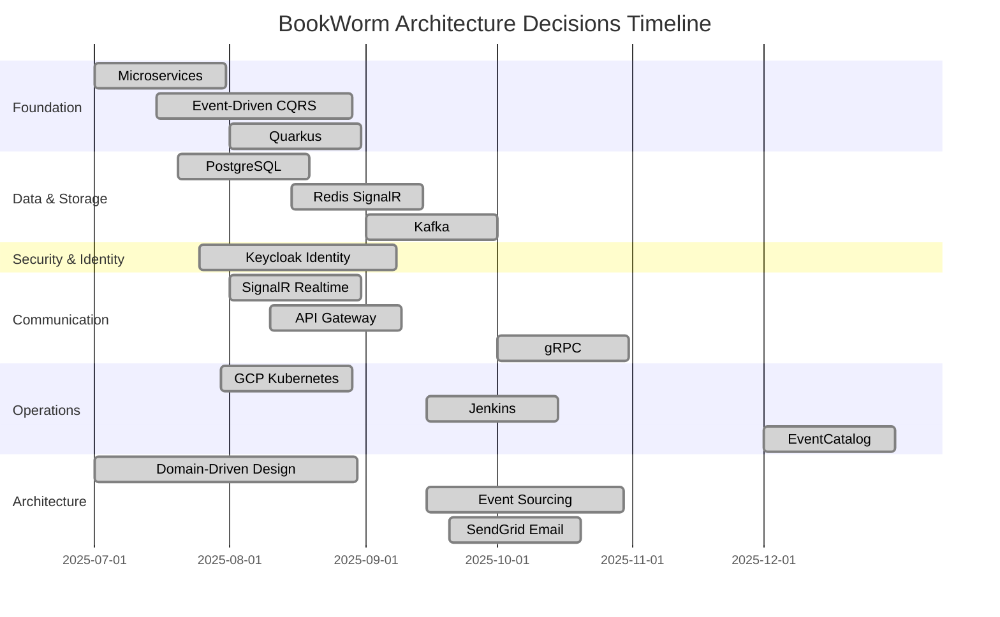
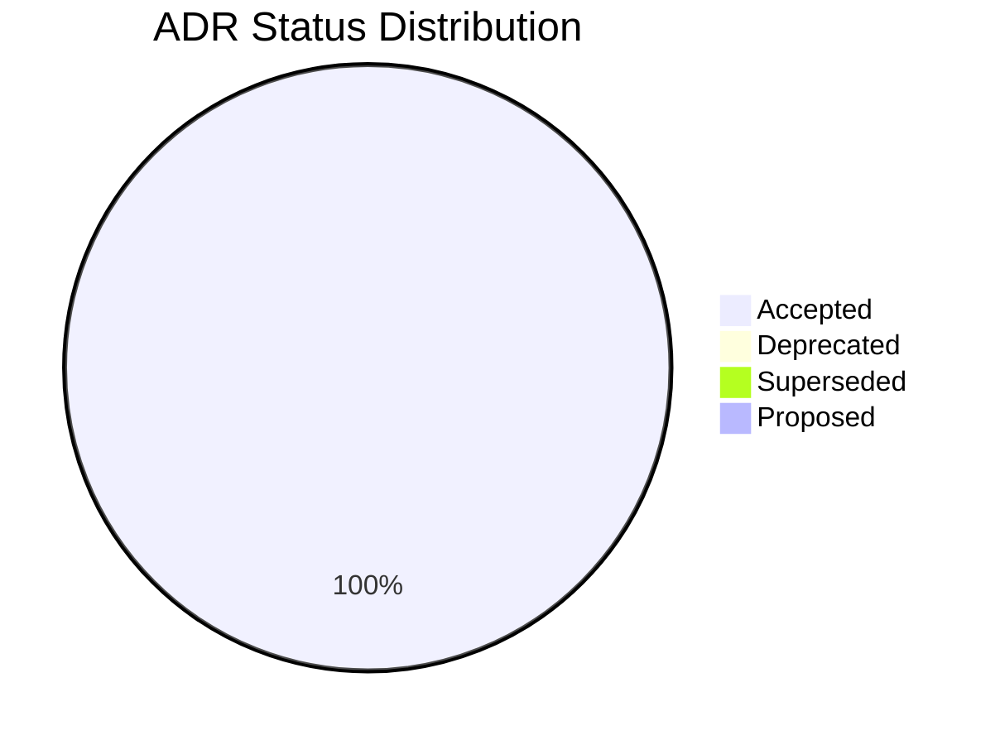
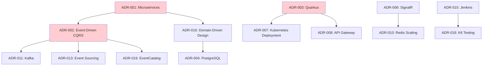

# Architecture Decisions Overview

## Introduction

This section documents significant architectural decisions made for the eHailing project using Architecture Decision Records (ADRs). Each ADR captures the context, decision, rationale, and consequences of important architectural choices that shape the system's design and implementation.

## Decision Timeline



## ADR Categories

### 🏗️ Foundation Architecture

| ADR                                             | Title                                    | Status   | Impact |
| ----------------------------------------------- | ---------------------------------------- | -------- | ------ |
| [ADR-001](./adr-001-microservices-architecture) | Microservices Architecture               | Accepted | High   |
| [ADR-002](./adr-002-event-driven-cqrs)          | Event-Driven Architecture with CQRS      | Accepted | High   |
| [ADR-003](./adr-003-quarkus-cloud-native)       | Quarkus for Cloud-Native Development     | Accepted | High   |
| [ADR-016](./adr-016-ddd)                        | Domain-Driven Design Implementation      | Accepted | High   |

### 💾 Data & Storage

| ADR                                         | Title                          | Status   | Impact |
| ------------------------------------------- | ------------------------------ | -------- | ------ |
| [ADR-004](./adr-004-postgresql-database)    | PostgreSQL as Primary Database | Accepted | High   |
| [ADR-010](./adr-010-redis-signalr-scale)    | Redis for SignalR Scaling      | Accepted | Medium |
| [ADR-011](./adr-011-kafka-message)          | Kafka for Message Broker       | Accepted | High   |
| [ADR-013](./adr-013-wallet-eventsoucring)   | Event Sourcing for wallet      | Accepted | Medium |

### 🔒 Security & Identity

| ADR                                    | Title                            | Status   | Impact |
| -------------------------------------- | -------------------------------- | -------- | ------ |
| [ADR-005](./adr-005-keycloak-identity) | Keycloak for Identity Management | Accepted | High   |

### 🌐 Communication & Integration

| ADR                                          | Title                               | Status   | Impact |
| -------------------------------------------- | ----------------------------------- | -------- | ------ |
| [ADR-006](./adr-006-signalr-realtime)        | SignalR for Real-time Communication | Accepted | Medium |
| [ADR-008](./adr-008-api-gateway)             | API Gateway with YARP               | Accepted | High   |
| [ADR-017](./adr-017-grpc)                    | gRPC for Service Communication      | Accepted | Medium |
| [ADR-014](./adr-014-sendgrid-email-provider) | SendGrid Email Provider             | Accepted | Low    |

### ⚙️ Operations & Deployment

| ADR                                         | Title                                | Status   | Impact |
| ------------------------------------------- | ------------------------------------ | -------- | ------ |
| [ADR-007](./adr-007-gcp-deployment)         | GCP Kubernetes Deployment            | Accepted | High   |
| [ADR-015](./adr-015-jenkins-cicd)           | Jenkins for CI/CD                    | Accepted | Medium |
| [ADR-018](./adr-018-k6-performance-testing) | K6 Performance Testing Framework     | Accepted | Medium |
| [ADR-019](./adr-019-eventcatalog)           | EventCatalog for Event Documentation | Accepted | Low    |

## Decision Status Distribution



## Architecture Impact Analysis

### High Impact Decisions (8 ADRs)

These decisions fundamentally shape the system architecture and have wide-reaching consequences:

- **Microservices Architecture** - Defines overall system structure
- **Event-Driven CQRS** - Determines data flow and consistency patterns
- **Quarkus** - Cloud-native development approach
- **Domain-Driven Design** - Business domain alignment
- **PostgreSQL Database** - Data persistence strategy
- **Kafka Message Broker** - Async communication backbone
- **Keycloak Identity** - Security and authentication foundation
- **API Gateway** - External interface and routing

### Medium Impact Decisions (5 ADRs)

These decisions significantly affect specific aspects or components:

- **Redis SignalR Scaling** - Real-time communication scalability
- **SignalR Realtime** - Bi-directional communication capability
- **Event Sourcing** - Audit trail and temporal queries
- **gRPC Communication** - High-performance inter-service calls
- **Jenkins CI/CD** - Deployment automation
- **K6 Performance Testing** - Quality assurance framework

### Low Impact Decisions (2 ADRs)

These decisions address specific functional requirements:

- **SendGrid Email** - Email delivery service
- **EventCatalog Documentation** - Event schema documentation

## Decision Dependencies



## Key Architectural Principles

Based on the ADR decisions, eHailing follows these core principles:

### 🎯 Business Alignment

- **Domain-Driven Design** ensures technical implementation matches business domain
- **Event-Driven Architecture** reflects real-world business processes
- **CQRS** separates read and write concerns for optimal user experience

### 🔄 Scalability & Resilience

- **Microservices** enable independent scaling and deployment
- **Event Sourcing** provides complete audit trails and replay capabilities
- **Kubernetes Deployment** offer scaling and high availability

### ⚡ Performance & Quality

- **Async Communication** via events and messaging
- **Real-time Capabilities** through SignalR connections
- **Comprehensive Testing** with automated performance validation

## ADR Process

### Creating New ADRs

1. **Identify Decision Need**: Significant architectural choice with long-term impact
2. **Research Context**: Gather requirements, constraints, and stakeholder input
3. **Evaluate Alternatives**: Consider multiple options with pros/cons analysis
4. **Document Decision**: Use standard ADR template with clear rationale
5. **Review & Approval**: Get stakeholder review before marking as "Accepted"
6. **Update Dependencies**: Link related ADRs and update overview

### ADR Template Structure

```markdown
# ADR-XXX: [Decision Title]

## Status

**[Proposed|Accepted|Deprecated|Superseded]** - [Date]

## Context

[Describe the situation and constraints]

## Decision

[What was decided and key implementation details]

## Rationale

[Why this decision was made]

## Implementation

[How the decision is implemented]

## Consequences

### Positive

[Benefits and positive outcomes]

### Challenges

[Drawbacks and risks]

## Alternatives Considered

[Other options that were evaluated]

## Related Decisions

[Links to other relevant ADRs]
```

## Change Management

### Modifying Decisions

- **Status Updates**: Change status to Deprecated or Superseded
- **New ADRs**: Create new decisions that supersede old ones
- **Impact Analysis**: Document effects on dependent decisions
- **Migration Path**: Provide clear transition strategy

### Decision Evolution

ADRs evolve through their lifecycle:

- **Proposed** → **Accepted** → **Implemented**
- **Accepted** → **Deprecated** (when better alternatives emerge)
- **Accepted** → **Superseded** (when replaced by new decisions)

## Success Metrics

The architecture decisions are validated through:

- **System Performance**: Response times, throughput, scalability
- **Development Velocity**: Time to implement features, deployment frequency
- **Operational Metrics**: Uptime, error rates, recovery time
- **Business Metrics**: User satisfaction, feature adoption, cost efficiency
- **Quality Metrics**: Test coverage, security compliance, maintainability

## Related Documentation

- [Technical Risks and Debts](../risks-and-technical-debts): Risk analysis related to architectural decisions
- [Quality Requirements](../quality-requirements/overview): Quality attributes addressed by ADRs
- [Building Block View](../building-block-view/glassbox-overall-system): How ADRs shape system components
