# Technical Risks and Debts

## Introduction

This section identifies and analyzes technical risks that could impact eHailing's development, deployment, and operation. It also documents current technical debt and strategies for continuous risk management and debt reduction.

## Technical Risks

### High-Priority Risks

#### RISK-001: External Mapping Service Dependencies 🔴

- **Risk Level**: HIGH
- **Probability**: Medium (30-50%)
- **Impact**: High - Mapping features unavailable, degraded user experience

**Description**: eHailing relies on external mapping services for search and initiating the ride requests functionality. Service outages, API changes, or rate limiting could significantly impact core features.

**Mitigation Strategies**:
- Implement circuit breaker pattern for mapping service calls
- Develop fallback mechanisms
- Create abstraction layer for easy map provider switching
- Establish SLA monitoring and alerting
- Maintain local cache of common mapping responses

**Contingency Plan**:
- Pre-computed recommendation fallbacks

---

#### RISK-002: Database Performance Bottlenecks 🟡

- **Risk Level**: MEDIUM-HIGH
- **Probability**: High (60-80%)
- **Impact**: Medium - System slowdown, poor user experience

**Description**: As eHailing scales, PostgreSQL databases may become performance bottlenecks, especially for ride booking requests.

**Mitigation Strategies**:
- Implement read replicas for query distribution
- Database connection pooling and query optimization
- Comprehensive Redis caching strategy
- Continuous database performance monitoring
- Plan for database sharding if needed

**Contingency Plan**:
- Emergency horizontal scaling with read replicas
- Cache warming procedures for critical data
- Database query optimization sprints

---

### Medium-Priority Risks

#### RISK-003: Keycloak Single Point of Failure 🟡

- **Risk Level**: MEDIUM
- **Probability**: Low (20-30%)
- **Impact**: High - Complete authentication failure

**Description**: Keycloak as the central identity provider could become a single point of failure, preventing all user authentication and authorization.

**Mitigation Strategies**:
- Keycloak high availability setup with clustering
- Regular backup of realm configuration and user data
- Health monitoring and automated recovery
- PostgreSQL backend for Keycloak data persistence

**Contingency Plan**:
- Emergency Keycloak instance deployment
- Cached JWT validation for temporary operation
- Manual user verification procedures

---

#### RISK-004: Websockets Scaling Challenges 🟡

- **Risk Level**: MEDIUM
- **Probability**: Medium (30-50%)
- **Impact**: Medium - Server push functionality degradation

**Description**: Websockets with Quarkus acting as master server may face scaling challenges under high concurrent loads, affecting real-time communication.

**Mitigation Strategies**:
- Connection monitoring and management
- Load testing for concurrent sessions
- Graceful connection handling and reconnection logic

**Contingency Plan**:
- Connection limit enforcement
- Fallback to polling-based communication
- websockets service horizontal scaling

## Technical Debt Inventory

### Current Technical Debt

TBA

## Risk Management Strategy

### Risk Assessment Matrix

### Monitoring and Alerting

| Risk Category             | Key Metrics                             | Alert Thresholds                        | Response Actions                           |
|---------------------------|-----------------------------------------|-----------------------------------------|--------------------------------------------|
| **External Dependencies** | AI service availability, response times | Availability < 99%, Response > 5s       | Circuit breaker activation, fallback modes |
| **Database Performance**  | Query execution time, connection pool   | Query time > 100ms, Pool exhaustion     | Query optimization, scaling triggers       |
| **Authentication**        | Failed login attempts, token validation | > 10 failures/minute, Validation errors | Account lockout, security alerts           |
| **Container Health**      | Service availability, resource usage    | Unhealthy containers, CPU > 80%         | Auto-scaling, health check failures        |

### Incident Response Procedures

#### Severity Classification

- **P1 (Critical)**: Complete service outage affecting all users
- **P2 (High)**: Major feature unavailable or severe performance degradation
- **P3 (Medium)**: Minor feature issues or localized performance problems
- **P4 (Low)**: Cosmetic issues or minor inconveniences

#### Response Timeline

| Severity | Response Time     | Resolution Target | Escalation                  |
|----------|-------------------|-------------------|-----------------------------|
| **P1**   | 15 minutes        | 1 hour            | Immediate CTO notification  |
| **P2**   | 1 hour            | 4 hours           | Technical lead notification |
| **P3**   | 4 hours           | 24 hours          | Team lead notification      |
| **P4**   | Next business day | 1 week            | Standard process            |

### Technical Debt Management

#### Debt Prioritization Framework

```mermaid
graph TD
    A[Technical Debt Identified] --> B{Business Impact Assessment}
    B -->|High| C{Technical Risk Level}
    B -->|Medium| D{Effort Required}
    B -->|Low| E[Backlog]

    C -->|High| F[🔴 Critical Priority]
    C -->|Medium| G[🟡 High Priority]
    C -->|Low| H[🟢 Medium Priority]

    D -->|Low| I[🟡 High Priority]
    D -->|Medium| J[🟢 Medium Priority]
    D -->|High| K[🔵 Low Priority]

    style F fill:#ffcdd2
    style G fill:#fff3e0
    style I fill:#fff3e0
    style H fill:#c8e6c9
    style J fill:#c8e6c9
    style K fill:#e3f2fd
    style E fill:#f5f5f5
```

#### Debt Reduction Strategy

**Sprint Integration**:
- Allocate 20% of each sprint to technical debt reduction
- Prioritize high-impact, low-effort debt items first
- Track debt reduction metrics and progress over time

**Quality Gates**:
- No new high-severity debt introduction without explicit approval
- Monthly technical debt review sessions with stakeholders
- Quarterly architecture review meetings for major decisions

**Automation**:
- Automated code quality analysis with SonarQube
- Security vulnerability scanning in CI/CD pipeline
- Performance regression testing with quality thresholds

## Continuous Improvement

### Risk Management Maturity

- **Current State**: Reactive risk management with basic monitoring
- **Target State**: Proactive risk management with predictive analytics
- **Improvement Plan**: Quarterly maturity assessments and capability enhancements

### Learning from Incidents

1. **Post-Mortem Process**: Blameless post-mortems for all P1/P2 incidents
2. **Root Cause Analysis**: Systematic analysis using Five Whys methodology
3. **Action Items**: Concrete improvement actions with owners and timelines
4. **Knowledge Sharing**: Regular sharing of lessons learned across teams

### Technology Evolution Strategy

- **Technology Radar**: Quarterly assessment of emerging technologies
- **Proof of Concepts**: Controlled evaluation of new technologies
- **Migration Planning**: Systematic approach to technology updates
- **Training Investment**: Continuous team skill development and knowledge updates

## Related Documentation

- [Quality Requirements](./quality-requirements/overview): Quality scenarios and requirements
- [Architecture Decisions](./architecture-decisions/overview): ADRs documenting key technical decisions
- [Deployment View](./deployment-view/overview): Infrastructure and deployment considerations
